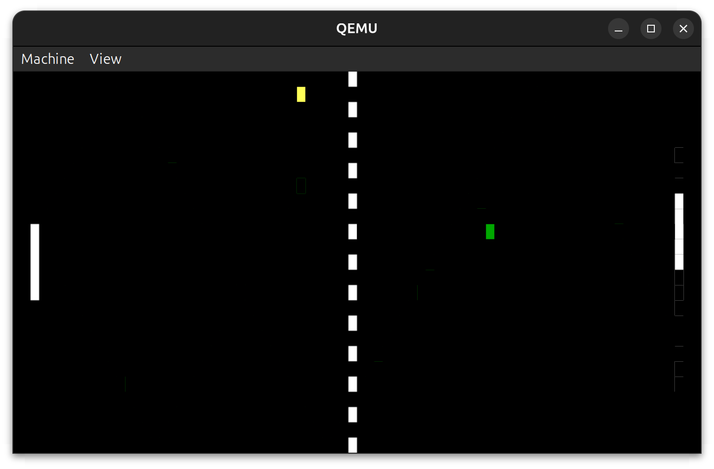

# Bootsector Pong

A tiny, 16-bit x86 assembly game of Pong that fits entirely within a 512-byte bootsector.

This project is a classic "Hello, World!" for low-level bootsector programming, demonstrating how to control video, keyboard input, and timing using only BIOS interrupts and direct memory access.



---

## 🚀 Features

* **Player vs. CPU:** Play against a simple AI opponent.
* **Scoring:** First player to 3 points wins the game.
* **Dynamic Difficulty:** CPU paddle speed increases slightly as the player scores.
* **Simple Controls:** Uses `W` and `S` for paddle movement.
* **Extras:**
    * `R` key to reset the game (by triggering a `int 19h` boot).
    * `C` key to cycle through different paddle colors.
* **Tiny Footprint:** The entire compiled game is exactly 512 bytes.

---

## 🛠️ How to Build and Run

You will need two main tools to build and run this project:
1.  **NASM** (The Netwide Assembler)
2.  **QEMU** (An open-source machine emulator)

### 1. Assemble the Bootsector

To assemble the code, you need to tell NASM to create a "flat binary" file.

```bash
cd pong

nasm -f bin bootsector_pong.asm -o pong.bin
```

### 2. Run the code

You can now boot this binary file directly in the QEMU emulator. The -fda flag tells QEMU to treat our file as a virtual floppy disk.

```bash
qemu-system-i386 -fda pong.bin
```

The emulator window will appear, and the game will start immediately.